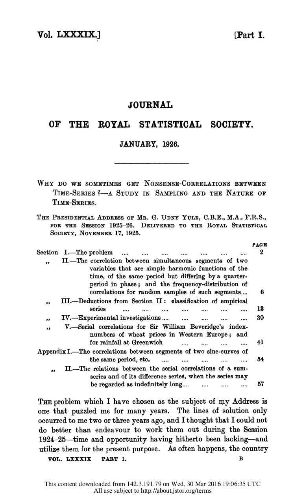
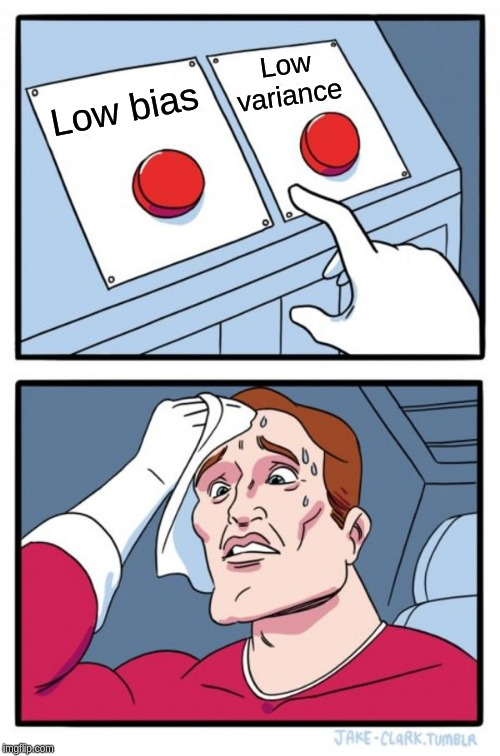

```{r setup, include=FALSE}
options(htmltools.dir.version = FALSE, cache = FALSE)
knitr::opts_chunk$set(cache = TRUE, dev = "svg", echo = FALSE, message = FALSE, warning = FALSE,
                      fig.height=6, fig.width = 1.777777*6)

library("curl")
library("mgcv")
library("purrr")
library("dplyr")
library("tibble")
library("mvnfast")
library("ggplot2")
#library("cowplot")
library("patchwork")
theme_set(theme_minimal())
library("tidyr")
d15n_label <- expression(delta^{15} * N) # y-axis label for plot
library("gratia")
library("gganimate")
library("here")
library("readr")
library("readxl")

## constats
anim_width <- 1000
anim_height <- anim_width / 1.77777777
anim_dev <- "png"
anim_res <- 200

```

class: inverse
background-image: url("./resources/victor-freitas-548350-unsplash.jpg")
background-size: cover

# Palaeo data are time series

### Interest in changes in the data over time &mdash; implies the estimation of trends in data

### Commonly, trend detection involves eye-balling the data

Not reproducible &mdash; poor science

Conflates **signal** and **noise**

Not thinking about **effect size**

.footnote[
<a style="background-color:black;color:white;text-decoration:none;padding:4px 6px;font-family:-apple-system, BlinkMacSystemFont, &quot;San Francisco&quot;, &quot;Helvetica Neue&quot;, Helvetica, Ubuntu, Roboto, Noto, &quot;Segoe UI&quot;, Arial, sans-serif;font-size:12px;font-weight:bold;line-height:1.2;display:inline-block;border-radius:3px" href="https://unsplash.com/@victorfreitas?utm_medium=referral&amp;utm_campaign=photographer-credit&amp;utm_content=creditBadge" target="_blank" rel="noopener noreferrer" title="Download free do whatever you want high-resolution photos from Victor Freitas"><span style="display:inline-block;padding:2px 3px"><svg xmlns="http://www.w3.org/2000/svg" style="height:12px;width:auto;position:relative;vertical-align:middle;top:-1px;fill:white" viewBox="0 0 32 32"><title>unsplash-logo</title><path d="M20.8 18.1c0 2.7-2.2 4.8-4.8 4.8s-4.8-2.1-4.8-4.8c0-2.7 2.2-4.8 4.8-4.8 2.7.1 4.8 2.2 4.8 4.8zm11.2-7.4v14.9c0 2.3-1.9 4.3-4.3 4.3h-23.4c-2.4 0-4.3-1.9-4.3-4.3v-15c0-2.3 1.9-4.3 4.3-4.3h3.7l.8-2.3c.4-1.1 1.7-2 2.9-2h8.6c1.2 0 2.5.9 2.9 2l.8 2.4h3.7c2.4 0 4.3 1.9 4.3 4.3zm-8.6 7.5c0-4.1-3.3-7.5-7.5-7.5-4.1 0-7.5 3.4-7.5 7.5s3.3 7.5 7.5 7.5c4.2-.1 7.5-3.4 7.5-7.5z"></path></svg></span><span style="display:inline-block;padding:2px 3px">Victor Freitas</span></a>
]

---
class: inverse
background-image: url("./resources/neonbrand-395901-unsplash.jpg")
background-size: cover

# What statistical analysis is done is often wrong

.footnote[
<a style="background-color:black;color:white;text-decoration:none;padding:4px 6px;font-family:-apple-system, BlinkMacSystemFont, &quot;San Francisco&quot;, &quot;Helvetica Neue&quot;, Helvetica, Ubuntu, Roboto, Noto, &quot;Segoe UI&quot;, Arial, sans-serif;font-size:12px;font-weight:bold;line-height:1.2;display:inline-block;border-radius:3px" href="https://unsplash.com/@neonbrand?utm_medium=referral&amp;utm_campaign=photographer-credit&amp;utm_content=creditBadge" target="_blank" rel="noopener noreferrer" title="Download free do whatever you want high-resolution photos from NeONBRAND"><span style="display:inline-block;padding:2px 3px"><svg xmlns="http://www.w3.org/2000/svg" style="height:12px;width:auto;position:relative;vertical-align:middle;top:-2px;fill:white" viewBox="0 0 32 32"><title>unsplash-logo</title><path d="M10 9V0h12v9H10zm12 5h10v18H0V14h10v9h12v-9z"></path></svg></span><span style="display:inline-block;padding:2px 3px">NeONBRAND</span></a>
]

---
class: inverse
background-image: url("./resources/aron-visuals-322314-unsplash.jpg")
background-size: cover

# Time waits for no palaeolimnologist

.footnote[
<a style="background-color:black;color:white;text-decoration:none;padding:4px 6px;font-family:-apple-system, BlinkMacSystemFont, &quot;San Francisco&quot;, &quot;Helvetica Neue&quot;, Helvetica, Ubuntu, Roboto, Noto, &quot;Segoe UI&quot;, Arial, sans-serif;font-size:12px;font-weight:bold;line-height:1.2;display:inline-block;border-radius:3px" href="https://unsplash.com/@aronvisuals?utm_medium=referral&amp;utm_campaign=photographer-credit&amp;utm_content=creditBadge" target="_blank" rel="noopener noreferrer" title="Download free do whatever you want high-resolution photos from Aron Visuals"><span style="display:inline-block;padding:2px 3px"><svg xmlns="http://www.w3.org/2000/svg" style="height:12px;width:auto;position:relative;vertical-align:middle;top:-2px;fill:white" viewBox="0 0 32 32"><title>unsplash-logo</title><path d="M10 9V0h12v9H10zm12 5h10v18H0V14h10v9h12v-9z"></path></svg></span><span style="display:inline-block;padding:2px 3px">Aron Visuals</span></a>
]

---
class: inverse
background-image: url("./resources/alex-konokh-777923-unsplash.jpg")
background-size: cover

# Never join the dots

## You're conflating signal and noise

.footnote[
<a style="background-color:black;color:white;text-decoration:none;padding:4px 6px;font-family:-apple-system, BlinkMacSystemFont, &quot;San Francisco&quot;, &quot;Helvetica Neue&quot;, Helvetica, Ubuntu, Roboto, Noto, &quot;Segoe UI&quot;, Arial, sans-serif;font-size:12px;font-weight:bold;line-height:1.2;display:inline-block;border-radius:3px" href="https://unsplash.com/@shngpr?utm_medium=referral&amp;utm_campaign=photographer-credit&amp;utm_content=creditBadge" target="_blank" rel="noopener noreferrer" title="Download free do whatever you want high-resolution photos from Alex Konokh"><span style="display:inline-block;padding:2px 3px"><svg xmlns="http://www.w3.org/2000/svg" style="height:12px;width:auto;position:relative;vertical-align:middle;top:-2px;fill:white" viewBox="0 0 32 32"><title>unsplash-logo</title><path d="M10 9V0h12v9H10zm12 5h10v18H0V14h10v9h12v-9z"></path></svg></span><span style="display:inline-block;padding:2px 3px">Alex Konokh</span></a>
]

---

# Spurious correlation

.row[

.col-8[

Two time series may be correlated because

* of their relationship with a third confounding variable
* of nothing, they're just both going up or down for no common reason

Correlation is simply a measure of the strength of association between two series

### Correlation ≠ Causation

]

.col-4[
.center[]
]

]

---
background-image: url("./resources/chart.png")
background-size: contain


.footnote[Source: Tyler Vigen [www.tylervigen.com/spurious-correlations](http://www.tylervigen.com/spurious-correlations)]

---

# Non-parametric ≠ no assumptions

.row[

.col-7[

You can calculate $r$, $\rho$, or $\tau$ on time series — but what do they mean?

When you *test* $r$, $\rho$, or $\tau$ you need theory & assumptions

Key is **independent observations**

Palaeo data almost surely violate those assumptions

*p* values become meaningless

]

.col-5[
.center[]
]

]

---

# Never smooth data you input to a statistical test

.row[

.col-6[
### Ever — not once

It makes the test result *moar significant*

You just threw away the noise!

]

.col-6[

]

]

.row[

.col-12[
### Palaeo data are often already smoothed. We should & can — but don't — account for this
]

]

---
class: inverse
background-image: url('resources/mathew-macquarrie-149083-unsplash.jpg')
background-size: cover

# .smallcaps[Loess] must die

.footnote[
<a style="background-color:black;color:white;text-decoration:none;padding:4px 6px;font-family:-apple-system, BlinkMacSystemFont, &quot;San Francisco&quot;, &quot;Helvetica Neue&quot;, Helvetica, Ubuntu, Roboto, Noto, &quot;Segoe UI&quot;, Arial, sans-serif;font-size:12px;font-weight:bold;line-height:1.2;display:inline-block;border-radius:3px" href="https://unsplash.com/@deskfire?utm_medium=referral&amp;utm_campaign=photographer-credit&amp;utm_content=creditBadge" target="_blank" rel="noopener noreferrer" title="Download free do whatever you want high-resolution photos from Mathew MacQuarrie"><span style="display:inline-block;padding:2px 3px"><svg xmlns="http://www.w3.org/2000/svg" style="height:12px;width:auto;position:relative;vertical-align:middle;top:-2px;fill:white" viewBox="0 0 32 32"><title>unsplash-logo</title><path d="M10 9V0h12v9H10zm12 5h10v18H0V14h10v9h12v-9z"></path></svg></span><span style="display:inline-block;padding:2px 3px">Mathew MacQuarrie</span></a>
]

---

# .smallcaps[Loess] (for inference) must die

.row[

.col-7[
.smallcaps[Loess] is a scatterplot smoother &mdash; for EDA

The fit is controlled by the *span*

Must choose *span* appropriately

Difficult (impossible?) to do properly&hellip;

As a result often chosen subjectively!

Plain wrong &mdash; don't do it!

Don't use .smallcaps[Loess] for inference&hellip; exploratory data analysis only
]

.col-5[

]
]

---

# .smallcaps[Loess] must die — but we all use it

.center[]

Consensus reconstruction — total 💩

.footnote[Source: **Simpson** & Hall (2012) Human Impacts&hellip; *DPER Vol. 5* [doi: 
10/c49x](http://doi.org/c49x)]

---
class: inverse
background-image: url('resources/ross-findon-303091-unsplash.jpg')
background-size: contain

# What are we to do&hellip;?

.footnote[<a style="background-color:black;color:white;text-decoration:none;padding:4px 6px;font-family:-apple-system, BlinkMacSystemFont, &quot;San Francisco&quot;, &quot;Helvetica Neue&quot;, Helvetica, Ubuntu, Roboto, Noto, &quot;Segoe UI&quot;, Arial, sans-serif;font-size:12px;font-weight:bold;line-height:1.2;display:inline-block;border-radius:3px" href="https://unsplash.com/@rossf?utm_medium=referral&amp;utm_campaign=photographer-credit&amp;utm_content=creditBadge" target="_blank" rel="noopener noreferrer" title="Download free do whatever you want high-resolution photos from Ross Findon"><span style="display:inline-block;padding:2px 3px"><svg xmlns="http://www.w3.org/2000/svg" style="height:12px;width:auto;position:relative;vertical-align:middle;top:-1px;fill:white" viewBox="0 0 32 32"><title>unsplash-logo</title><path d="M20.8 18.1c0 2.7-2.2 4.8-4.8 4.8s-4.8-2.1-4.8-4.8c0-2.7 2.2-4.8 4.8-4.8 2.7.1 4.8 2.2 4.8 4.8zm11.2-7.4v14.9c0 2.3-1.9 4.3-4.3 4.3h-23.4c-2.4 0-4.3-1.9-4.3-4.3v-15c0-2.3 1.9-4.3 4.3-4.3h3.7l.8-2.3c.4-1.1 1.7-2 2.9-2h8.6c1.2 0 2.5.9 2.9 2l.8 2.4h3.7c2.4 0 4.3 1.9 4.3 4.3zm-8.6 7.5c0-4.1-3.3-7.5-7.5-7.5-4.1 0-7.5 3.4-7.5 7.5s3.3 7.5 7.5 7.5c4.2-.1 7.5-3.4 7.5-7.5z"></path></svg></span><span style="display:inline-block;padding:2px 3px">Ross Findon</span></a>]

---
class: inverse
background-image: url(resources/roman-mager-59976-unsplash.jpg)
background-size: cover

# .alpha[Model your data]

.footnote[<a style="background-color:black;color:white;text-decoration:none;padding:4px 6px;font-family:-apple-system, BlinkMacSystemFont, &quot;San Francisco&quot;, &quot;Helvetica Neue&quot;, Helvetica, Ubuntu, Roboto, Noto, &quot;Segoe UI&quot;, Arial, sans-serif;font-size:12px;font-weight:bold;line-height:1.2;display:inline-block;border-radius:3px" href="https://unsplash.com/@roman_lazygeek?utm_medium=referral&amp;utm_campaign=photographer-credit&amp;utm_content=creditBadge" target="_blank" rel="noopener noreferrer" title="Download free do whatever you want high-resolution photos from Roman Mager"><span style="display:inline-block;padding:2px 3px"><svg xmlns="http://www.w3.org/2000/svg" style="height:12px;width:auto;position:relative;vertical-align:middle;top:-1px;fill:white" viewBox="0 0 32 32"><title>unsplash-logo</title><path d="M20.8 18.1c0 2.7-2.2 4.8-4.8 4.8s-4.8-2.1-4.8-4.8c0-2.7 2.2-4.8 4.8-4.8 2.7.1 4.8 2.2 4.8 4.8zm11.2-7.4v14.9c0 2.3-1.9 4.3-4.3 4.3h-23.4c-2.4 0-4.3-1.9-4.3-4.3v-15c0-2.3 1.9-4.3 4.3-4.3h3.7l.8-2.3c.4-1.1 1.7-2 2.9-2h8.6c1.2 0 2.5.9 2.9 2l.8 2.4h3.7c2.4 0 4.3 1.9 4.3 4.3zm-8.6 7.5c0-4.1-3.3-7.5-7.5-7.5-4.1 0-7.5 3.4-7.5 7.5s3.3 7.5 7.5 7.5c4.2-.1 7.5-3.4 7.5-7.5z"></path></svg></span><span style="display:inline-block;padding:2px 3px">Roman Mager</span></a>]

---

# Model your data

Many models available for time series but palaeo data are often unhelpful

1. uneven spacing of observations in time (typically)

2. compaction, variable accumulation rates &rarr; non-constant variance

Can't use typical statistical time series models

**But we can use generalized additive models**

---
class: inverse
background-image: url('./resources/franki-chamaki-z4H9MYmWIMA-unsplash.jpg')
background-size: cover

# 

.footnote[
<a style="background-color:black;color:white;text-decoration:none;padding:4px 6px;font-family:-apple-system, BlinkMacSystemFont, &quot;San Francisco&quot;, &quot;Helvetica Neue&quot;, Helvetica, Ubuntu, Roboto, Noto, &quot;Segoe UI&quot;, Arial, sans-serif;font-size:12px;font-weight:bold;line-height:1.2;display:inline-block;border-radius:3px" href="https://unsplash.com/@franki?utm_medium=referral&amp;utm_campaign=photographer-credit&amp;utm_content=creditBadge" target="_blank" rel="noopener noreferrer" title="Download free do whatever you want high-resolution photos from Franki Chamaki"><span style="display:inline-block;padding:2px 3px"><svg xmlns="http://www.w3.org/2000/svg" style="height:12px;width:auto;position:relative;vertical-align:middle;top:-2px;fill:white" viewBox="0 0 32 32"><title>unsplash-logo</title><path d="M10 9V0h12v9H10zm12 5h10v18H0V14h10v9h12v-9z"></path></svg></span><span style="display:inline-block;padding:2px 3px">Franki Chamaki</span></a>
]

???

We learn from data because it can highlight our preconceptions and biases

---

# Learning from data

```{r lm-plot, fig.height=6, fig.width = 1.777777*6}
## simulate some data for a linear model
set.seed(1)
N <- 250
lm_dat <- tibble(x = runif(N), y = 0.5 + (2.1 * x) + rnorm(N, sd = 0.5))
## plot
ggplot(lm_dat, aes(x = x, y = y)) +
    geom_point() +
    geom_smooth(method = 'lm') +
    theme_minimal(base_size = 20, base_family = 'Fira Sans')
```

???

Learning from data could be a simple as fitting a linear regression model...

---
class: inverse
background-image: url('./resources/deep-learning-turned-up-to-11.jpg')
background-size: contain

# 

???

Or as complex as fitting a sophisticated multi-layered neural network trained on huge datasets or corpora

---

# Learning involves trade-offs

.row[
.col-6[
.center[]
]

.col-6[
.center[]
]
]

???

Learning from data involves trade offs

We can have models that fit our data well &mdash; low bias &mdash; but which are highly variable, or

We can fit models that have lower variance, but these tend to have higher bias, i.e. fit the data less well

A linear regression model is very interpretable but unless the underlying relationship is linear it will have poor fit

Deep learning may fit data incredibly well but the model is very difficult to interpret and understand

---

# Generalized Additive Models

<br />


.references[Source: [GAMs in R by Noam Ross](https://noamross.github.io/gams-in-r-course/)]

???

GAMs are an intermediate-complexity model

* can learn from data without needing to be informed by the user
* remain interpretable because we can visualize the fitted features

---
class: inverse middle center large-subsection

# GAMs fit wiggly functions

---
class: inverse
background-image: url('resources/wiggly-things.png')
background-size: contain

???

---

```{r smooth-fun-animation, results = FALSE}
f <- function(x) {
    x^11 * (10 * (1 - x))^6 + ((10 * (10 * x)^3) * (1 - x)^10)
}

draw_beta <- function(n, k, mu = 1, sigma = 1) {
    rmvn(n = n, mu = rep(mu, k), sigma = diag(rep(sigma, k)))
}

weight_basis <- function(bf, x, n = 1, k, ...) {
    beta <- draw_beta(n = n, k = k, ...)
    out <- sweep(bf, 2L, beta, '*')
    colnames(out) <- paste0('f', seq_along(beta))
    out <- as_tibble(out)
    out <- add_column(out, x = x)
    out <- pivot_longer(out, -x, names_to = 'bf', values_to = 'y')
    out
}

random_bases <- function(bf, x, draws = 10, k, ...) {
    out <- rerun(draws, weight_basis(bf, x = x, k = k, ...))
    out <- bind_rows(out)
    out <- add_column(out, draw = rep(seq_len(draws), each = length(x) * k),
                      .before = 1L)
    class(out) <- c("random_bases", class(out))
    out
}

plot.random_bases <- function(x, facet = FALSE) {
    plt <- ggplot(x, aes(x = x, y = y, colour = bf)) +
        geom_line(lwd = 1, alpha = 0.75) +
        guides(colour = FALSE)
    if (facet) {
        plt + facet_wrap(~ draw)
    }
    plt
}

normalize <- function(x) {
    rx <- range(x)
    z <- (x - rx[1]) / (rx[2] - rx[1])
    z
}

set.seed(1)
N <- 500
data <- tibble(x     = runif(N),
               ytrue = f(x),
               ycent = ytrue - mean(ytrue),
               yobs  = ycent + rnorm(N, sd = 0.5))

k <- 10
knots <- with(data, list(x = seq(min(x), max(x), length = k)))
sm <- smoothCon(s(x, k = k, bs = "cr"), data = data, knots = knots)[[1]]$X
colnames(sm) <- levs <- paste0("f", seq_len(k))
basis <- pivot_longer(cbind(sm, data), -(x:yobs), names_to = 'bf')
basis

set.seed(2)
bfuns <- random_bases(sm, data$x, draws = 20, k = k)

smooth <- bfuns %>%
    group_by(draw, x) %>%
    summarise(spline = sum(y)) %>%
    ungroup()

p1 <- ggplot(smooth) +
    geom_line(data = smooth, aes(x = x, y = spline), lwd = 1.5) +
    labs(y = 'f(x)', x = 'x') +
    theme_minimal(base_size = 16, base_family = 'Fira Sans')

smooth_funs <- animate(
    p1 + transition_states(draw, transition_length = 4, state_length = 2) + 
    ease_aes('cubic-in-out'),
    nframes = 200, height = anim_height, width = anim_width, res = anim_res, dev = anim_dev)

anim_save('resources/spline-anim.gif', smooth_funs)
```

# Wiggly things

.center[]

???

GAMs use splines to represent the non-linear relationships between covariates, here `x`, and the response variable on the `y` axis.

---
class: inverse middle center massive-subsection

# GAMs

---
class: inverse
background-image: url('./resources/rob-potter-398564.jpg')
background-size: contain

# GAMs are not magical

.footnote[
<a style="background-color:black;color:white;text-decoration:none;padding:4px 6px;font-family:-apple-system, BlinkMacSystemFont, &quot;San Francisco&quot;, &quot;Helvetica Neue&quot;, Helvetica, Ubuntu, Roboto, Noto, &quot;Segoe UI&quot;, Arial, sans-serif;font-size:12px;font-weight:bold;line-height:1.2;display:inline-block;border-radius:3px;" href="https://unsplash.com/@robpotter?utm_medium=referral&amp;utm_campaign=photographer-credit&amp;utm_content=creditBadge" target="_blank" rel="noopener noreferrer" title="Download free do whatever you want high-resolution photos from Rob Potter"><span style="display:inline-block;padding:2px 3px;"><svg xmlns="http://www.w3.org/2000/svg" style="height:12px;width:auto;position:relative;vertical-align:middle;top:-1px;fill:white;" viewBox="0 0 32 32"><title></title><path d="M20.8 18.1c0 2.7-2.2 4.8-4.8 4.8s-4.8-2.1-4.8-4.8c0-2.7 2.2-4.8 4.8-4.8 2.7.1 4.8 2.2 4.8 4.8zm11.2-7.4v14.9c0 2.3-1.9 4.3-4.3 4.3h-23.4c-2.4 0-4.3-1.9-4.3-4.3v-15c0-2.3 1.9-4.3 4.3-4.3h3.7l.8-2.3c.4-1.1 1.7-2 2.9-2h8.6c1.2 0 2.5.9 2.9 2l.8 2.4h3.7c2.4 0 4.3 1.9 4.3 4.3zm-8.6 7.5c0-4.1-3.3-7.5-7.5-7.5-4.1 0-7.5 3.4-7.5 7.5s3.3 7.5 7.5 7.5c4.2-.1 7.5-3.4 7.5-7.5z"></path></svg></span><span style="display:inline-block;padding:2px 3px;">Rob Potter</span></a>
]


---
class: inverse middle center large-subsection

# Basis Expansions

---
class: inverse center middle huge-subsection

# Example

---

# HadCRUT4 time series

```{r hadcrut-temp-example}
## Load Data
tmpf <- tempfile()
curl_download("https://www.metoffice.gov.uk/hadobs/hadcrut4/data/current/time_series/HadCRUT.4.6.0.0.annual_nh.txt", tmpf)
gtemp <- read.table(tmpf, colClasses = rep("numeric", 12))[, 1:2] # only want some of the variables
names(gtemp) <- c("Year", "Temperature")
gtemp <- as_tibble(gtemp)

## Plot
gtemp_plt <- ggplot(gtemp, aes(x = Year, y = Temperature)) +
    geom_line() + 
    geom_point() +
    labs(x = 'Year', y = expression(Temeprature ~ degree*C)) +
    theme_minimal(base_size = 20, base_family = 'Fira Sans')
gtemp_plt
```

---

# Polynomials

```{r hadcrut-temp-polynomial}
p <- c(1,3,8,15)
N <- 300
newd <- with(gtemp, data.frame(Year = seq(min(Year), max(Year), length = N)))
polyFun <- function(i, data = data) {
    lm(Temperature ~ poly(Year, degree = i), data = data)
}
mods <- lapply(p, polyFun, data = gtemp)
pred <- vapply(mods, predict, numeric(N), newdata = newd)
colnames(pred) <- p
newd <- cbind(newd, pred)
polyDat <- gather(newd, Degree, Fitted, - Year)
polyDat <- mutate(polyDat, Degree = ordered(Degree, levels = p))
gtemp_plt + geom_line(data = polyDat, mapping = aes(x = Year, y = Fitted, colour = Degree),
                      size = 1.5, alpha = 0.9) +
    scale_color_brewer(name = "Degree", palette = "PuOr") +
    theme(legend.position = "right")
```

---
class: inverse middle center large-subsection

# Not that basis expansion

---

# Splines formed from basis functions

```{r basis-functions, fig.height=6, fig.width = 1.777777*6}
ggplot(basis,
       aes(x = x, y = value, colour = bf)) +
    geom_line(lwd = 2, alpha = 0.5) +
    guides(colour = FALSE) +
    labs(x = 'x', y = 'b(x)') +
    theme_minimal(base_size = 20, base_family = 'Fira Sans')
```

???

Splines are built up from basis functions

Here I'm showing a cubic regression spline basis with 10 knots/functions

We weight each basis function to get a spline. Here all the basisi functions have the same weight so they would fit a horizontal line

---

# Weight basis functions &#8680; spline

```{r basis-function-animation, results = 'hide'}
bfun_plt <- plot(bfuns) +
    geom_line(data = smooth, aes(x = x, y = spline),
              inherit.aes = FALSE, lwd = 1.5) +
    labs(x = 'x', y = 'f(x)') +
    theme_minimal(base_size = 14, base_family = 'Fira Sans')

bfun_anim <- animate(
    bfun_plt + transition_states(draw, transition_length = 4, state_length = 2) + 
    ease_aes('cubic-in-out'),
    nframes = 200, height = anim_height, width = anim_width, res = anim_res, dev = anim_dev)

anim_save('resources/basis-fun-anim.gif', bfun_anim)
```

.center[]

???

But if we choose different weights we get more wiggly spline

Each of the splines I showed you earlier are all generated from the same basis functions but using different weights

---

# How do GAMs learn from data?

```{r example-data-figure, fig.height=6, fig.width = 1.777777*6}
data_plt <- ggplot(data, aes(x = x, y = ycent)) +
    geom_line(col = 'goldenrod', lwd = 2) +
    geom_point(aes(y = yobs), alpha = 0.2, size = 3) +
    labs(x = 'x', y = 'f(x)') +
    theme_minimal(base_size = 20, base_family = 'Fira Sans')
data_plt
```

???

How does this help us learn from data?

Here I'm showing a simulated data set, where the data are drawn from the orange functions, with noise. We want to learn the orange function from the data

---

# Maximise penalised log-likelihood &#8680; &beta;

```{r basis-functions-anim, results = "hide"}
sm2 <- smoothCon(s(x, k = k, bs = "cr"), data = data, knots = knots)[[1]]$X
beta <- coef(lm(ycent ~ sm2 - 1, data = data))
wtbasis <- sweep(sm2, 2L, beta, FUN = "*")
colnames(wtbasis) <- colnames(sm2) <- paste0("F", seq_len(k))
## create stacked unweighted and weighted basis
basis <- as_tibble(rbind(sm2, wtbasis)) %>%
    add_column(x = rep(data$x, times = 2),
               type = rep(c('unweighted', 'weighted'), each = nrow(sm2)),
               .before = 1L)
##data <- cbind(data, fitted = rowSums(scbasis))
wtbasis <- as_tibble(rbind(sm2, wtbasis)) %>%
    add_column(x      = rep(data$x, times = 2),
               fitted = rowSums(.),
               type   = rep(c('unweighted', 'weighted'), each = nrow(sm2))) %>%
    pivot_longer(-(x:type), names_to = 'bf')
basis <- pivot_longer(basis, -(x:type), names_to = 'bf')

p3 <- ggplot(data, aes(x = x, y = ycent)) +
    geom_point(aes(y = yobs), alpha = 0.2) +
    geom_line(data = basis,
              mapping = aes(x = x, y = value, colour = bf),
              lwd = 1, alpha = 0.5) +
    geom_line(data = wtbasis,
              mapping = aes(x = x, y = fitted), lwd = 1, colour = 'black', alpha = 0.75) +
    guides(colour = FALSE) +
    labs(y = 'f(x)', x = 'x') +
    theme_minimal(base_size = 16, base_family = 'Fira Sans')

crs_fit <- animate(p3 + transition_states(type, transition_length = 4, state_length = 2) + 
                   ease_aes('cubic-in-out'),
                   nframes = 100, height = anim_height, width = anim_width, res = anim_res,
                   dev = anim_dev)

anim_save('./resources/gam-crs-animation.gif', crs_fit)
```

.center[]

???

Fitting a GAM involves finding the weights for the basis functions that produce a spline that fits the data best, subject to some constraints

---
class: inverse middle center subsection

# Avoid overfitting our sample

---
class: inverse middle center subsection

# Use a wiggliness penalty &mdash; avoid fitting too wiggly models

---
class: inverse center middle huge-subsection

# Example

---

# HadCRUT4 time series

```{r hadcrut-temp-penalty}
K <- 40
lambda <- c(10000, 1, 0.01, 0.00001)
N <- 300
newd <- with(gtemp, data.frame(Year = seq(min(Year), max(Year), length = N)))
fits <- lapply(lambda, function(lambda) gam(Temperature ~ s(Year, k = K, sp = lambda), data = gtemp))
pred <- vapply(fits, predict, numeric(N), newdata = newd)
op <- options(scipen = 100)
colnames(pred) <- lambda
newd <- cbind(newd, pred)
lambdaDat <- gather(newd, Lambda, Fitted, - Year)
lambdaDat <- transform(lambdaDat, Lambda = factor(paste("lambda ==", as.character(Lambda)),
                                                  levels = paste("lambda ==", as.character(lambda))))

gtemp_plt + geom_line(data = lambdaDat, mapping = aes(x = Year, y = Fitted, group = Lambda),
                      size = 1, colour = "#e66101") +
    facet_wrap( ~ Lambda, ncol = 2, labeller = label_parsed)
options(op)
```

---
class: inverse center middle big-subsection

# OK some math

---
class: inverse center middle large-subsection

# How wiggly?

$$
\int_{\mathbb{R}} [f^{\prime\prime}]^2 dx = \boldsymbol{\beta}^{\mathsf{T}}\mathbf{S}\boldsymbol{\beta}
$$

---
class: inverse center middle large-subsection

# Penalised fit

$$
\mathcal{L}_p(\boldsymbol{\beta}) = \mathcal{L}(\boldsymbol{\beta}) - \frac{1}{2} \lambda\boldsymbol{\beta}^{\mathsf{T}}\mathbf{S}\boldsymbol{\beta}
$$

---

# Fitted GAM

```{r hadcrutemp-fitted-gam}
m <- gamm(Temperature ~ s(Year), data = gtemp, correlation = corARMA(form = ~ Year, p = 1))

N <- 300
newd <- as_tibble(with(gtemp, data.frame(Year = seq(min(Year), max(Year), length = N))))
pred <- as_tibble(as.data.frame(predict(m$gam, newdata = newd, se.fit = TRUE,
                                        unconditional = TRUE)))
pred <- bind_cols(newd, pred) %>%
    mutate(upr = fit + 2 * se.fit, lwr = fit - 2*se.fit)

ggplot(gtemp, aes(x = Year, y = Temperature)) +
    geom_point() +
    geom_ribbon(data = pred,
                mapping = aes(ymin = lwr, ymax = upr, x = Year), alpha = 0.4, inherit.aes = FALSE,
                fill = "#fdb338") +
    geom_line(data = pred,
              mapping = aes(y = fit, x = Year), inherit.aes = FALSE, size = 1, colour = "#025196") +
    labs(x = 'Year', y = expression(Temeprature ~ degree*C)) +
    theme_minimal(base_size = 20, base_family = 'Fira Sans')
```

---
class: inverse middle center massive-subsection

# mgcv

---

# Generalized additive model

Linear trend model

$$\mathbb{E}(y_i) = \beta_0 + \beta_1 x_i$$

GAM

$$\mathbb{E}(y_i) = \beta_0 + f(x_i)$$

$f(\mathbf{x})$ is the trend &mdash; we assume trend is **smooth**

---

# Fitting GAMs in *mgcv*

Wrap a variable in `s( )` to get a smooth

```{r model-fit-mgcv, echo = TRUE}
m <- gam(Temperature ~ s(Year, k = 20), data = gtemp, method = "REML")
```

User chooses `k` &mdash; the number of basis functions used to represent $f(x_i)$

Think of `k` as an upper limit on wiggliness

Fit using REML or ML (`method = "ML"`) smoothness selection

GCV can undersmooth but it's the default!

---

# Choosing a response family

A GLM / GAM can be written as

\begin{align}
y_i & \sim \mathcal{D}(\mu_i, \theta) \\
g(\mu_i) & = \eta_i = \beta_0 + \beta_1 x_{1i} + f(x_{2i}) + \cdots \\
\mu_i & = g^{-1}(\beta_0 + \beta_1 x_{1i} + f(x_{2i}) + \cdots) \\
\end{align}

$\mathcal{D}$ is some distribution with a mean and possibly some other parameters

$g()$ is the link function that maps from the $-\infty - +\infty$ scale to the response scale

What values to the response can take helps dictate the choice of `family`

---

# Choosing a response family

* Can the response take any real value? `gaussian()` or `scat()`
* Is the response integer counts? `poisson()`, `nb()`
* Is the response continuous but positive reals? `Gamma()`, `inverse.gaussian()`, `tw()`
* Is the response non-negative continuous reals? `tw()`
* Is the response a proportion? `betar()`
* Is the response 0/1? `binomial()`
* Is the response a binomial count? `binomial()`

There are other choices in {mgcv} & I'm not covering the location scale shape or specialized families here

---

# Braya-S&oslash;

Alkenone unsaturation index &mdash; temperature interpretation

<br />

.center[
```{r braya-so-data, fig.width = 9, fig.height = 3.5, cache = FALSE, echo = FALSE, dpi = 150, warning = FALSE}
theme_set(theme_bw())
## load braya so data set
braya <- read.table("./resources/DAndrea.2011.Lake Braya So.txt", skip = 84)
names(braya) <- c("Depth", "DepthUpper", "DepthLower", "Year", "YearYoung",
                  "YearOld", "UK37")
braya <- transform(braya, sampleInterval = YearYoung - YearOld,
                   YearBP = 1950 - Year, negYearBP = - (1950-Year))
braya_ylabel <- expression(italic(U)[37]^{italic(k)})

## Generate a plot of the data
braya_plt <- ggplot(braya, aes(x = YearBP, y = UK37)) +
    geom_line(colour = "grey80", size = 0.75) +
    geom_point(size = 2) +
    labs(y = braya_ylabel, x = "Year BP") +
    scale_x_reverse() +
    theme(text = element_text(size = 18))

braya_plt
```
]

.footnote[D’Andrea, *et al* (2011). PNAS *108*: 9765&ndash;9769. [doi: 10/brnm2n](https://doi.org/10.1073/pnas.1101708108)]

---

# Braya-S&oslash; &mdash; estimated trend

We get some wiggles &mdash; but which are real?

```{r braya-fitted-gam, cache = FALSE, echo = FALSE}
bmod <- gam(UK37 ~ s(negYearBP, k = 45), data = braya, method = "REML",
            weights = sampleInterval / mean(sampleInterval))
newBraya <- with(braya,
                 data.frame(Year = seq(min(Year), max(Year), length.out = 500)))
newBraya <- transform(newBraya, YearBP = 1950 - Year,
                                negYearBP = - (1950 - Year))
braya_pred <- cbind(newBraya, data.frame(predict(bmod, newBraya,
                                                 se.fit = TRUE)))
braya_pred <- transform(braya_pred, upper = fit + (2 * se.fit),
                                    lower = fit - (2 * se.fit)) 
```

<br />

.center[
```{r braya-fitted-gam-plot, fig.width = 9, fig.height = 3.5, cache = FALSE, echo = FALSE, dpi = 150}
ggplot(braya, aes(y = UK37, x = YearBP)) +
    geom_point() +
    geom_ribbon(data = braya_pred,
                mapping = aes(x = YearBP, ymax = upper, ymin = lower),
                alpha = 0.3, inherit.aes = FALSE) +
    geom_line(data = braya_pred, mapping = aes(y = fit, x = YearBP)) +
    labs(y = braya_ylabel, x = "Year BP") +
    scale_x_reverse() +
    theme(text = element_text(size = 18))
```
]

---

# Calculus FTW!

Compute the first derivative of the spline and it's uncertainty

* Where confidence band *includes* **0** we fail reject the H<sub>0</sub> of *no change*
* Where *doesn't* include **0** we reject H<sub>0</sub> &rarr; conclude there's change

<br />
.center[
```{r ref.label = "braya-fitted-gam-plot", fig.width = 9, fig.height = 3.5, cache = FALSE, echo = FALSE, dpi = 150}
```
]

---

# Braya-S&oslash; rates of change

```{r braya-derivatives, echo = FALSE}
braya.d <- fderiv(bmod, newdata = newBraya, n = N)
braya.sint <- with(newBraya, cbind(confint(braya.d, nsim = 1000, type = "simultaneous"), Year = Year, YearBP = 1950 - Year))
```

<br />
.center[
```{r braya-derivatives-plot, fig.width = 9, fig.height = 3.5, cache = FALSE, echo = FALSE, dpi = 150}
theme_set(theme_bw())
ggplot(braya.sint, aes(x = YearBP, y = est)) +
    geom_ribbon(aes(ymin = lower, ymax = upper), alpha = 0.2, fill = "black") +
    geom_line() +
    labs(x = "Year BP", y = "First derivative") +
    scale_x_reverse() +
    theme(text = element_text(size = 18))
```
]

Use `gratia::derivatives()` for computing now, not `fderiv()` from the supplementary materials

---

# What else&hellip;?

Once you start to think in terms of models you can address problems out of reach previously:

* *models for mean and variance* &mdash; resilience & tipping points (?)
* *account for age-model uncertainty*
* *compare trends across multiple sites*
* &hellip;

---

# Lake 227: eutrophication &rarr; increased variance

.row[
.col-6[

]

.col-6[
]
]

---
class: inverse
background-image: url('./resources/mathew-macquarrie-677399-unsplash.jpg')
background-size: cover

# GAMs are a gateway drug

Hierarchical GAMs &mdash; Pedersen et al (2019) *PeerJ*.&nbsp; [doi: 10/c49w](http://doi.org/c49w)

Non-linear variation partitioning &mdash; Simpson & Anderson (2009) *Limnology & Oceanography* [doi: 10/dqfznq](http://doi.org/dqfznq)

Models for

* variance
* extremes / quantiles

Joint models for bivariate correlations

Multivariate models

.footnote[
<a style="background-color:black;color:white;text-decoration:none;padding:4px 6px;font-family:-apple-system, BlinkMacSystemFont, &quot;San Francisco&quot;, &quot;Helvetica Neue&quot;, Helvetica, Ubuntu, Roboto, Noto, &quot;Segoe UI&quot;, Arial, sans-serif;font-size:12px;font-weight:bold;line-height:1.2;display:inline-block;border-radius:3px" href="https://unsplash.com/@deskfire?utm_medium=referral&amp;utm_campaign=photographer-credit&amp;utm_content=creditBadge" target="_blank" rel="noopener noreferrer" title="Download free do whatever you want high-resolution photos from Mathew MacQuarrie"><span style="display:inline-block;padding:2px 3px"><svg xmlns="http://www.w3.org/2000/svg" style="height:12px;width:auto;position:relative;vertical-align:middle;top:-2px;fill:white" viewBox="0 0 32 32"><title>unsplash-logo</title><path d="M10 9V0h12v9H10zm12 5h10v18H0V14h10v9h12v-9z"></path></svg></span><span style="display:inline-block;padding:2px 3px">Mathew MacQuarrie</span></a>
]

---
class: inverse
background-image: url('./resources/hennie-stander-1347894-unsplash.jpg')
background-size: cover

# Training

.alpha[
Palaeolimnology was a qualitative science

Key figures dragged us into the world of quantitative palaeolimnology

Training and software were critical for this revolution

We have the software we need now &mdash; R

A renewed need for training in modern methods
]

<br />

### .alpha[What should that training look like?]

.footnote[
<a style="background-color:black;color:white;text-decoration:none;padding:4px 6px;font-family:-apple-system, BlinkMacSystemFont, &quot;San Francisco&quot;, &quot;Helvetica Neue&quot;, Helvetica, Ubuntu, Roboto, Noto, &quot;Segoe UI&quot;, Arial, sans-serif;font-size:12px;font-weight:bold;line-height:1.2;display:inline-block;border-radius:3px" href="https://unsplash.com/@henniestander?utm_medium=referral&amp;utm_campaign=photographer-credit&amp;utm_content=creditBadge" target="_blank" rel="noopener noreferrer" title="Download free do whatever you want high-resolution photos from Hennie Stander"><span style="display:inline-block;padding:2px 3px"><svg xmlns="http://www.w3.org/2000/svg" style="height:12px;width:auto;position:relative;vertical-align:middle;top:-2px;fill:white" viewBox="0 0 32 32"><title>unsplash-logo</title><path d="M10 9V0h12v9H10zm12 5h10v18H0V14h10v9h12v-9z"></path></svg></span><span style="display:inline-block;padding:2px 3px">Hennie Stander</span></a>
]

---

# Want to know more&hellip;?

.row[
.col-7[
Paper &mdash; [doi:10/gfrc4p](http://doi.org/gfrc4p)

Blog &mdash; [fromthebottomoftheheap.net](https://fromthebottomoftheheap.net)

Slides &mdash; [bit.ly/pals-stats](http://bit.ly/pals-stats)
]

.col-5[

]

]

---
class: inverse middle center big-subsection

# Advanced Topics

---
class: inverse middle center big-subsection

# HGAMs

---

# Hierarchical GAMs

A HGAM is a model where we have multiple sequences

* multiple species in a single core/site

* multiple species in multiple cores/sites

* same proxy at multiple cores/sites

Don't model each species / proxy separately &mdash; model everything in a single model

Random splines &mdash; use the smooth equivalent of a random effect

---

# Hierarchical GAMs

.row[

.col-7[

Build a HGAM is a number of ways

* Common shared trend?
* Same wiggliness per group smooth
* Different wiggliness per group smooth

]

.col-5[

.center[
```{r hgam-models}

```
]
]
]

---

# Hierarchical GAMs &mdash; common trend?

Model with a common trend

```{r common-trend, echo = TRUE, eval = FALSE}
## random spline version - same wiggliness
gam(y ~ s(time) + s(time, group, bs = "fs"), method = "REML")

## by variable version - different wiggliness
gam(y ~ group + s(time) + s(time, by = group, m = 1), method = "REML")
```

We need `group` as a factor term in the `by` version to account for the group means

`m = 1` penalises deviation from a flat function (deviation from common trend)

---

# Hierarchical GAMs &mdash; common trend?

Model *without* a common trend

```{r no-common-trend, echo = TRUE, eval = FALSE}
## random spline version - same wiggliness
gam(y ~ s(time, group, bs = "fs"), method = "REML")

## by variable version - different wiggliness
gam(y ~ group + s(time, by = group), method = "REML")
```

We need `group` as a factor term in the `by` version to account for the group means

---
class: inverse middle center big-subsection

# Distributional Models

---
class: inverse middle center big-subsection

# Mean

???

The mean

When we analyze data we mostly focus on this property of our data

With summary statistics we often talk about the average of a set of values

Or in a statistical model we might estimate expected change in the response for some change in one or more covariates

Or we may be interested in estimating the trend in a data series where the trend described how the expected value of y changes over time


---
class: inverse middle center big-subsection

# Variance

???

There are other important properties of data however and in the short case study I want to talk about the variance & how we can use statistical models to investigate changes in the variance of ecosystems over time

---

# Variance

Intuitive & key descriptor of ecosystem state

.row[
.col-6[
.center[
```{r high-resilience}
knitr::include_graphics('./resources/scheffer-2012-high-resilience.jpg')
```
]
]

.col-6[
.center[
```{r low-resilience}
knitr::include_graphics('./resources/scheffer-2012-low-resilience.jpg')
```
]
]
.col-12[
.small[Source: Scheffer *et al* Science (2012)]
]
]

???

The variance is an important measure of ecosystem state

Ecologists have linked variance with coexistence of populations and variance can be interpreted in terms of resilience theory

Here I'm showing two cartoons;

A: in the high resilience state the ecosystem returns rapidly to the equilibrium following perturbation and hence has low variance

B: in the low resilience state, where the basin of attraction has become shallower, the ecosystem takes longer to return to equilibrium following perturbation and hence exhibits high variance

Variance, however, is much harder to estimate from data

---

# Moving windows &mdash; don't do this!

.row[
.col-6[

Moving window approach:

1. detrend
2. choose window size
3. estimate variance
4. move window 1 time step
5. repeat 3. & 4. until done
6. look for trend

]

.col-6[
.center[
```{r moving-window}
knitr::include_graphics('./resources/dakos-rolling-window-figure-modified.png')
```
]
.small[Modified from Dakos *et al* (2012) PLOS One]
]
]

???

One way to estimate the variance of a series is by using a moving window

Here the analyst first detrends the time series

Choose an appropriate window size

Starting from the beginning of the series calculate the variance of the observations in the window

Move the window along one time step and repeat 3 and 4 until you get to the end of the series

A trend in the resulting variance time series is estimated using Kendall's rank correlation tau

In this example the interest was in the end of the series so they right-aligned the window meaning they had to observe half the series before they could calculate the variance

---

# Problems

*Ad hoc*

* How to detrend (method, complexity of trend, ...)
* What window width?

Ideally regularly spaced data

* What to do about gaps, missing data, irregularly spaced data?

Statistical testing hard

* Kendall's $\tau$ assumes independence
* Surrogate time series assumes regular sampling, sensitive to choice of ARMA

???

The whole approach is *ad hoc* with many knobs to twiddle &mdash; how do you detrend the series? what width of window should be used?

Suited to regularly spaced data so you have the same number of observations in each window, but what about series with data gaps, missing observations, or data that are irregularly spaced?

Statistical inference is very hard; Kendall's tau assumes the data are independence but they can't be because of the moving window. Sometime surrogate time series are used to assess significance of the trend in variance; Surrogate time series are series generated with known properties that don't have a change in variance, but these approaches rely on classical techniques like ARMA models which only work for regularly spaced data and the test is sensitive to choice of orders in the ARMA

---
class: inverse middle center big-subsection

# Lake 227

???

Today I want to illustrate how we can use modern statistical models to continuously estimate the variance of multivariate time series using data from Lake 227 in the Experimental Lakes Area, Canada

---

# Lake 227

.row[
.col-6[
* Experimentally manipulated
* Annual sediment samples 1943&ndash;1990
]
.col-6[
* Analyzed for fossil pigments
]
]

Cottingham *et al* (2000) **Ecology Letters** showed via a Levene's test that **variances** pre- & post-intervention were different

???

The lake was experimentally manipulated to investigate responses to increased nutrients

The lake is annually laminated and Peter Leavitt, URegina, measured the sub-fossil pigment concentrations for each year between 1943 and 1990

Kathy Cottingham, Jim Rusak, and Peter Leavitt previously analyzed these data by separating them into control and treated sections and compared the variances of the two periods with a Levene's test, equivalent of a t-test but for differences of variances not means

They showed that the algal community was more variable in the treated period than in the pre-manipulation period

---

# Lake 227

```{r lake-227-pigment-data}
## Load data from ~/work/data/ela/lake227
lake227 <- read_excel('~/work/data/ela/lake227/CONC227.xlsx')
## Peter highlighted Fuco, Allox, Lutzeax, Pheo_b, Bcarot
vars <- c('YEAR', 'FUCO', 'ALLOX', 'LUTZEAX', 'PHEO_B', 'BCAROT')#, 'ECHINENO', 'MYXO')
lake227 <- lake227[, vars]
names(lake227) <- c('Year', 'Fucoxanthin', 'Alloxanthin', 'LuteinZeaxanthin',
                    'Pheophytinb', 'BetaCarotene')#, 'Echinenone', 'Myxoxnthophyll')
## take data from 1943 onwards
lake227 <- subset(lake227, Year >= 1943)
lake227 <- as_tibble(lake227)
## to long format for modelling
lake227 <- gather(lake227, key = Pigment, value = Concentration, - Year)
lake227 <- lake227 %>%
    mutate(Pigment = as.character(Pigment),
           Pigment = case_when(
               Pigment == 'BetaCarotene' ~ 'beta ~ carotene',
               Pigment == 'Pheophytinb' ~ 'Pheophytin ~ italic(b)',
               Pigment == 'LuteinZeaxanthin' ~ 'atop(Lutein, Zeaxanthin)',
               TRUE ~ Pigment),
           )

ggplot(lake227, aes(x = Year, y = Concentration, group = Pigment, colour = Pigment)) +
    geom_line(size = 1) +
    geom_point(size = 2) +
    facet_grid(Pigment ~ ., scales = 'free_y', labeller = 'label_parsed') +
    theme(legend.position = 'none',
          strip.text.y = element_text(size = 14, angle = 0),
          strip.background = element_rect(colour = '#fdb338', fill = '#fdb338')) +
    labs(x = NULL, y = expression(Concentration ~ (italic(n) * g ~ g^{-1})))
```

???

Today I will focus only on the main algal groups:

* diatoms & chrysophytes through Fucoxanthin,
* cryptophytes through Alloxanthin,
* cyanobacteria and chlorophytes through Lutein-Zeaxanthin & pheophytin b, and
* total algae through beta carotene

---
class: inverse middle center big-subsection

# Challenge

???

The challenge is to estimate how the mean **and** the variance changed continuously throughout the experimental manipulation

---

# Parameters beyond the mean

```{r gaussian-distributions-plt}
x <- seq(8, -8, length = 500)
df <- data.frame(density = c(dnorm(x, 0, 1), dnorm(x, 0, 2), dnorm(x, 2, 1), dnorm(x, -2, 1)),
                 x = rep(x, 4),
                 distribution = factor(rep(c("mean = 0; var = 1", "mean = 0; var = 4",
                                             "mean = 2; var = 1", "mean = -2; var = 1"), each = 500),
                                       levels = c("mean = 0; var = 1", "mean = 0; var = 4",
                                                  "mean = 2; var = 1", "mean = -2; var = 1")))
plt1 <- ggplot(subset(df, distribution %in% c("mean = 0; var = 1", "mean = 0; var = 4")),
               aes(x = x, y = density, colour = distribution)) +
    geom_line(size = 1) + theme(legend.position = "top") +
    guides(col = guide_legend(title = "Distribution", nrow = 2, title.position = "left")) +
    labs(x = 'x', y = "Probability density")

plt2 <- ggplot(subset(df, distribution %in% c("mean = 2; var = 1", "mean = -2; var = 1")),
               aes(x = x, y = density, colour = distribution)) +
    geom_line(size = 1) + theme(legend.position = "top") +
    guides(col = guide_legend(title = "Distribution", nrow = 2, title.position = "left")) +
    labs(x = 'x', y = "Probability density")

plt <- wrap_plots(plt2, plt1, ncol = 2)
plt
```

???

To do this we'll need models for the variance of a data set

If we think of the Gaussian distribution that distribution has two parameters, the mean and the variance

In linear regression we model the mean of the response at different values of the covariates, and assume the variance is constant at a value estimated from the residuals

In the left panel I'm showing how the Gaussian distribution changes as we alter the mean while keeping the variance fixed, while in the right panel I keep the mean fixed but vary the variance &mdash; the parameters are independent

---

# Distributional models

.medium[
$$y_{i} | \boldsymbol{x}_i \boldsymbol{z}_i \sim \mathcal{D}(\vartheta_{1}(\boldsymbol{x}_i), \ldots, \vartheta_{K}(\boldsymbol{x}_i))$$
]

For the Gaussian distribution

* $\vartheta_{1}(\boldsymbol{x}_i) = \mu(\boldsymbol{x}_i)$

* $\vartheta_{2}(\boldsymbol{z}_i) = \sigma(\boldsymbol{z}_i)$

Provide a list of formulas, one per parameter

```{r gaulss-code, eval = FALSE, echo = TRUE}
m <- gam( list( y ~ s(time),          # <- formula for mean
                  ~ s(time) ),        # <- formula for variance 
          data = df, method = "REML", family = gaulss())
```

???

Instead of treating the variance as a nuisance parameter, we could model both the variance **and** the mean as functions of the covariates

This is done using what is called a *distributional model*

In this model we say that the response values y_i, given the values of one or more covariates x_i follow some distribution with parameters theta, which are themselves functions of one or more covariates

For the Gaussian distribution theta 1 would be the mean and theta 2 the variance (or standard deviation)

We do not need to restrict ourselves to the Gaussian distribution however

---

# The Gamma distribution

```{r gamma-dist}
shape <- c(2,2,3,3,5,5)
scale <- c(2,4,2,1,1,0.5)
x <- seq(0, 20, length.out = 500)
df <- as_tibble(as.data.frame(mapply(dgamma, shape, scale, MoreArgs = list(x = x))))
names(df) <- paste('shape =', shape, ', scale =', scale)
df <- add_column(df, x = x, row = seq_len(nrow(df)))
df <- gather(df, 'distribution', 'density', -row, -x)
plt <- ggplot(df, aes(x = x, y = density, colour = distribution)) +
    geom_line(lwd = 1) + guides(colour = "none") +
    scale_color_discrete(name = "") + ylim(0, 1.5) +
    labs(y = "Probability Density")
plt
```

???

The gamma distribution would be more appropriate for describing the pigment data as it allows for positive continuous values, where those values are skewed, with some large values

Here I'm showing different types of gamma distribution that vary in the mean and their variance and we should note that unlike the Gaussian distribution, we cannot change the mean without also changing the variance of the gamma distribution

---

# Lake 227 sedimentary pigments

Fitted gamma distributional model using {brms} 📦 and **Stan**
\begin{align*}
y_t    & \sim \mathcal{G}(\mu = \eta_{1,t}, \alpha = \eta_{2,t}) \\
\eta_{1,t} & = \exp(f_{1,\text{pigment}}(\text{Year}_t)) \\
\eta_{2,t} & = \exp(f_{2,\text{pigment}}(\text{Year}_t))
\end{align*}

Mean $\mu$ and shape $\alpha$ each modelled with "random effect" spline using `bs = "fs"`

Could also fit this using {mgcv} 📦 and `gammals()` or `twlss()` family if no censored pigments

???

To estimate how the mean and the variance of the pigment data changed during the experimental manipulation, I fitted a gamma distributional model using the brms package and the Stan Bayesian software

We assume the responses are conditionally distributed gamma, and we model the mean and the shape parameter of the distribution with linear predictors

Each linear predictor includes a smooth function of Year for each pigment

After fitting we calculate the variance at each time point using the estimated values of the mean and the shape parameters using the posterior distribution of the response to generate credible intervals

---

# Results &mdash; pigment means

```{r load-lake-227-results}
m2_summ <- read_rds(here('data', 'lake-227-m2-model-output.rds')) %>%
    mutate(Pigment = as.character(Pigment),
           Pigment = case_when(
               Pigment == 'BetaCarotene' ~ 'beta ~ carotene',
               Pigment == 'Pheophytinb' ~ 'Pheophytin ~ italic(b)',
               Pigment == 'LuteinZeaxanthin' ~ 'atop(Lutein, Zeaxanthin)',
               TRUE ~ Pigment),
           )
```

```{r lake-227-fitted-mean, dependson = -1}
ggplot(filter(m2_summ, Parameter == "Mean"),
       aes(x = Year, group = Pigment, fill = Pigment)) +
    geom_ribbon(aes(ymax = upper, ymin = lower, fill = Pigment), alpha = 0.2) +
    geom_line(aes(y = est, colour = Pigment), size = 1) +
    facet_grid(Pigment ~ ., scales = 'free_y', labeller = 'label_parsed') +
    theme(legend.position = 'none',
          strip.text.y = element_text(size = 14, angle = 0),
          strip.background = element_rect(colour = '#fdb338', fill = '#fdb338')) +
    labs(x = NULL, y = expression(Estimated ~ concentration ~ (italic(n) * g ~ g^{-1})))
```

???

This plot shows the estimated mean concentration for the five pigments estimated from the model, and which shows the increase in algal abundance during the experimental manipulation

---

# Results &mdash; pigment variances

```{r lake-227-fitted-sigma, dependson = -2}
ggplot(filter(m2_summ, Parameter == "Sigma"),
       aes(x = Year, group = Pigment, fill = Pigment)) +
    geom_ribbon(aes(ymax = upper, ymin = lower, fill = Pigment), alpha = 0.2) +
    geom_line(aes(y = est, colour = Pigment), size = 1) +
    facet_grid(Pigment ~ ., scales = 'free_y', labeller = 'label_parsed') +
    theme(legend.position = 'none', strip.text.y = element_text(size = 14, angle = 0),
          strip.background = element_rect(colour = '#fdb338', fill = '#fdb338')) +
    labs(x = NULL, y = expression(Estimated ~ sigma ~ (italic(n) * g ~ g^{-1})))
```

???

In this plot are showing the estimated variance throughout the time series

We clearly see the increased variance in the algal communities that Cottingham et al observed, but now we can provide a continuous estimate of the variance over time rather than having to split the data into two and compare the variance of the two time periods

---

# Variable variance

A feature of most palaeo data is heteroscedasticity

Compaction & varying sedimentation rates in time plus constant depth sampling

Some samples contain more lake years (time) than others

Thus the lake & the sampling scheme are averaging different amounts of time in each sample

Samples averaging more time have less variance all else equal

Must account for this if we want to model variance

---

# Variable variance

In the Lake Vera study we included `ellapsed_time` in the variance formula

`ellapsed_time` is a variable containing the amount of time contained in each sample

More details in Simpson (2018) Frontiers paper

---

# Acknowledgments

### Data

Peter Leavitt (URegina) for the Lake 227 pigment data

### Funding

.row[
.col-6[
.center[]
]

.col-6[
.center[]
]
]

